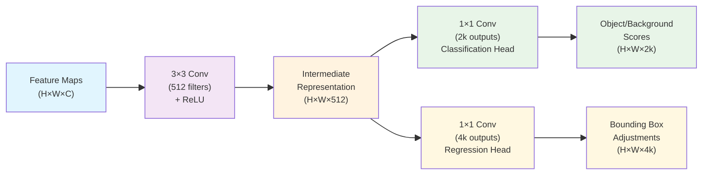

# Region Proposal Network (RPN)
## Introduction

RPN is a breakthrough in computer science that revolutionized object detection by efficiently identifying potential object locations in the image through neural network

## Core Innovation: Anchor

Every element on the feature map contains information of their receptive fields.

However, we don't exactly know how big is the object. Is it smaller than the receptive field? Or is it larger than the receptive field?

Before RPN, people just use sliding window and try out all possible bounded boxes. Now, we pre-define some common size bounded boxes and try them out at the region each feature map element corresponds to. We call these pre-defined boxes the **"anchors"**

Since the anchor size is fixed, we can combine multiple computations in one matrix multiplication, which boost the efficiency

---
# RPN Architecture
## Overall Architecture

- $k$ is the number of anchors, typically 9, consisting all combinations of 3 aspect ratios and 3 scales

## Explanation
### Classification Head (2k outputs)

- **Purpose**: Determine whether an object exists in each anchor location
- **Output**: 2 scores per position: $[\text{object probability}, \text{background probability}]$

### Regression Head (4k outputs)

- **Purpose**: Determine where the object is located
- **Output**: 4 scores per position: $[\Delta x, \Delta y, \Delta w, \Delta h]$, which gives how should we adjust the anchor size and position before send into final CNN

## Procedure

1. Predict classification scores and regression scores
2. If object probability suggest the anchor box contain an object, first we resize the anchor box with regression scores, then snap the corresponding region on the original image
3. The cropped image becomes a region proposal
4. Eliminate proposals detecting the same objects by [[D-DL4CV-Lec15cb-NMS|non-max suppression]]
5. Send the remaining proposals into final CNN